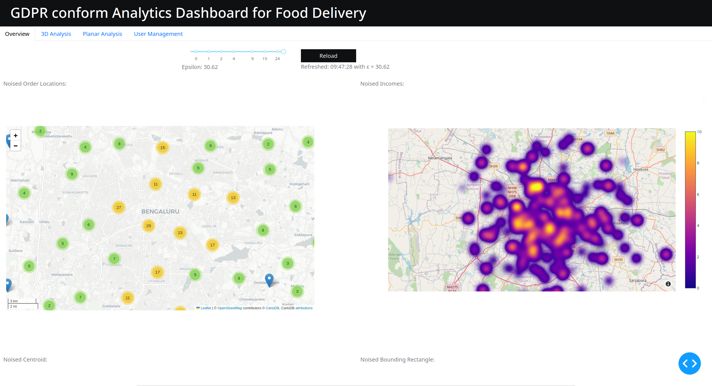

# Differential Privacy for real world Geospatial Systems

The widespread use of internet-connected devices has led to the generation of vast amounts of geospatial data. However, privacy regulations, such as the General Data Protection Regulation (GDPR), limit the collection and processing of personal data. This paper outlines the foundations for the implementation of differential privacy, a mathematical definition of privacy that
guarantees the protection of individual-level information, while
still enabling privacy-preserving analysis of geospatial data. The
goal is to develop a prototype extension that incorporates a
differentially private mechanism, allowing organizations to collect
and analyze geospatial data while adhering to privacy regulations.
The paper presents the system architecture and methodology
for enabling differential privacy on geospatial data, including
privacy budget establishment, aggregation and generalization,
location perturbation, privacy analysis, and utility considerations.
The proposed extension is implemented using PostgreSQL and
PostGIS, and open-source libraries for differential privacy. The
performance and usability of the implementation are assessed on
using a real geospatial dataset related to food delivery preferences. The report concludes with a discussion about challenges
and limitations of the proposed approach.

This implementation was realized as part of a project during the course "Privacy Engineering" in the summer semester of 2023 at the Technical University of Berlin. 



## Requirements

See the included `requirements.txt` (pip) or `environment.yaml` (conda) files. Python 3.9 or greater is required. 

The [GeoPrivacy](https://github.com/quao627/GeoPrivacy) package isn't available within Anaconda. It can still be used within a conda environment simply by installing it via pip.
```
pip install GeoPrivacy
```

For the database machine, a separate Python virtual environment is required. The required packages can be found in `server_requirements.txt`. This environment has to be created using the [virtualenv](https://github.com/pypa/virtualenv)-package.

The extension PL/Python has to be activated within the PostgreSQL database, to enable functions to be written in Python. For that, simply execute the following SQL-Query on the database:
```
CREATE EXTENSION plpython3u;
```
More information on that can be found in the official [documentation](https://www.postgresql.org/docs/current/plpython.html).

Furthermore, the extension PostGIS has to be installed on the database. Detailed information on the installation process can be found in the official PostGIS [documentation](https://postgis.net/documentation/getting_started/).

### settings.ini
This file contains all constants used within our application. For the database connection, all necessary settings are already present. If a SSH-connection is to be used, the necessary informations can be added under the section `[ssh]`.

## Usage 

To run the dashboard web app, run the following command. Ensure that the required dependencies are available. 
```
python GeoClient/app.py
```

The application will start a web server running on localhost. To access it, follow this URL: [localhost:8050](localhost:8050).
If this does not work, see the console output of the application for the correct URL.

### Manually executing the SQL-functions
To deploy the functions provided in `private_functions.sql`, simply execute the individual commands on your database with a SQL-Editor of your choice. When working with the functions directly within a SQL-Editor, make sure to activate the env beforehand, using this SQL-command:
```
SELECT activate_python_venv('/your/path/.venv');
```
The function can be executed by using the SQL SELECT command. For example:
```
SELECT private_bounding_rect(12.0, 25);
```
The first value for the function call is the epsilon value and has to be always entered as a floating point number (e.g. 12.0). The second value is the number of queries that should be executed. This can be entered as a normal integer (e.g. 3)

## Dashboard python scripts
### app.py
This is the main script, starting the server instance which hosts the dashboard application. It provides the main plots for our four selected geospatial aggregation methods, as well as the general UI of our web app.

### postgres.py
In this script, the establishment and handling of the database connection and data is realized. Among others, the functions `aggregator()` and `execute_query()` provide functionality for requesting, serializing and handling data from the PostgreSQL-database. They are available for usage by other scripts.

### evaluator_app.py
This script realizes the effectivity assessment of the main DP-functions, by visualizing the results of a batch-request analyses on - in this example - the private centroid method. By plotting the distribution of the counted occurrences of the returned centroid coordinates, comparisons to the distribution of real centroids can be made. By aggregating requested centroids and applying smoothing on the resulted data, the private centroids are plotted in three 3-dimensional plots, with the z-axis being the number of occurrences. The parameters of the privacy budget as well as the size of the batch execution can be set by the user and the results will be displayed in real-time.
**NOTE**: For batch sizes n > 1000, the execution can take some minutes. This is because of code as well as hardware constraints. 

### planareval.py
In this, a effectivity assessment in the form of a planar noise distribution is displayed. A more detailed explanation is available in the report. For this, differentially private coordinate data from all four aggregation methods is used. The user again is able to adjust epsilon and the size of the query batch freely, and results are displayed live.
**NOTE**: For batch sizes n > 1000, the execution can take some minutes. This is because of code as well as hardware constraints.

### creator_app.py
This script presents the functionality of adding self-defined data points to the database. This enables the evaluation of the DP-functions by comparing aggregation results before and after adding new datapoints to the dataset. For simplicity, the user is only able to enter coordinates and income values for new datapoints, as these are the only data features which are used in the dashboard yet. Also, the user is able to delete all newly added datapoints. 

# Common issues
    raise KeyError(key)
    KeyError: 'postgres'
Most probably, the path in line 105 in `postgres.py` isn't pointing to the correct `settings.ini`-file. Fix by adjusting the path string.

    SQL Error [38000]: ERROR: ModuleNotFoundError: No module named '<module_name>'
This error occurs when a private function is executed on the database, without the virtual environment being activated. See `Usage` to prevent this.
